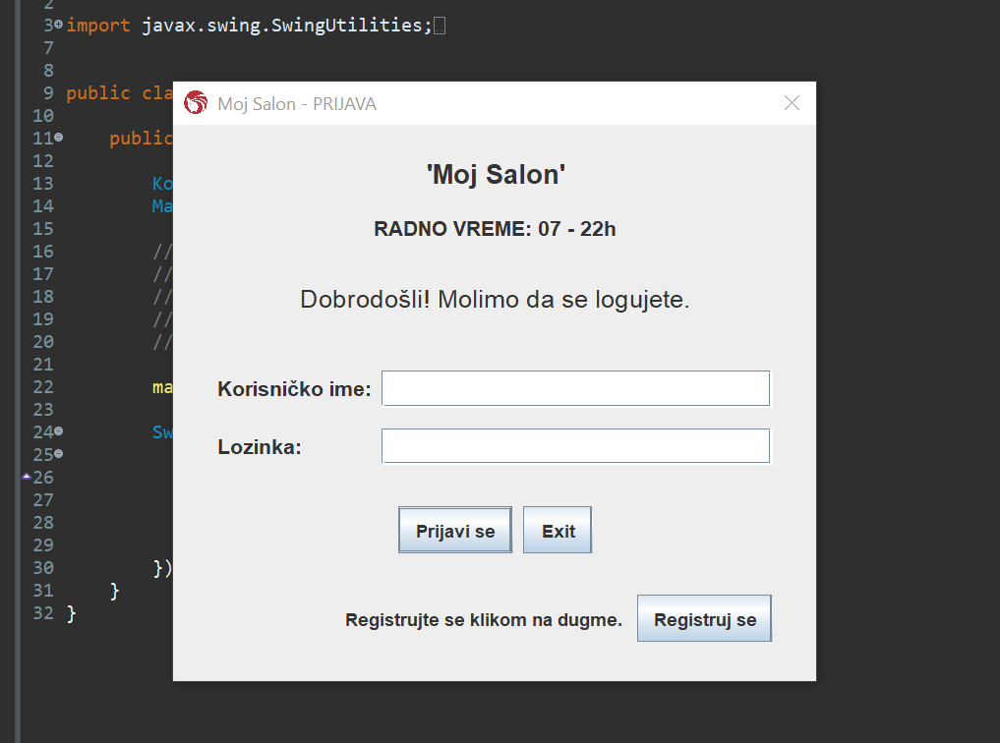
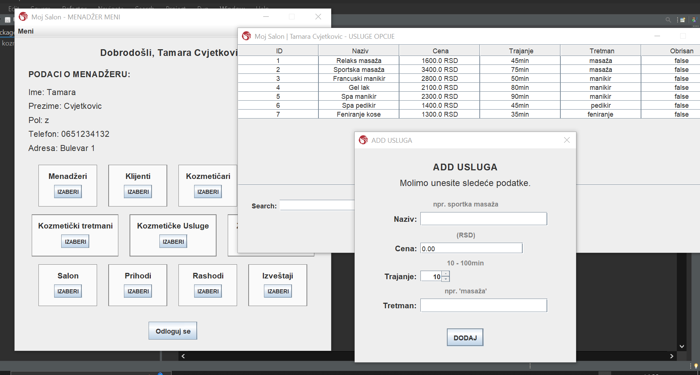

# Beauty Salon 💆🏻‍♀️

A GUI application for a beauty salon.

---

This was an university project for the course "Object-Oriented Programming 1", taken in the 2nd semester of the Software Engineering and Information Technologies program.

The ``goal`` of the project was to:
- become familiar with Java
- apply object-oriented programming principles,
- build a decent GUI using Java Swing,

#
Technologies used: 
- ``Java``
- ``Java Swing``
#
Date: March, 2023.

---

# How does it work? ❓
- there are four roles: Client, Manager, Beautician, and Receptionist
- each role has different options, some of the examples are:
  - CRUD on users and cosmetic treatments,
  - schedule, reschedule, and execute cosmetic treatments,
  - access the insights and reports (via charts),
  - access the list of previously attended cosmetic treatments, etc..

---

# Visual design: 🖼️

---

# Using the Application ⚙️

To use this application, follow the next steps:
1) clone this repo,
2) open the project in the Java IDE,
3) run the program

---

# Examples 💡

After you run the program, you can login or register. 

If you register, your profile is automatically saved as "Client". After logging-in (or after directly registering), depending on the role, you are given different options:

1) ``MANAGER``:
- you manage the whole application,
- you have the access to all data and you can add, edit or delete users, treatments and scheduled treatments or the salon informations (name, working hours etc..),
- you also have access to insight, including reports, earnings for specified time frames or diagrams (which you can access by clicking the button "Meni" in the top left corner)

2) ``CLIENT``:
- you can schedule your treatments by clicking the button "Zakazi tretman",
- you are given a list of all treatments, where you can search by type, name or/and price of the treatment,
  - after you choose one treatment, you can choose your beautician or you can let the program automatically assign one free beautician for that role to you,
  - lastly, you choose one currently free appointment, by selecting date and hour,
  - you can schedule the treatment by clicking button "Zakazi" or cancel it by pressing "Odustani",
  - you can also go back to change something by clicking "Nazad",
- on the profile window, there is a "Meni" where you can access all you previous/future treatments

3) ``BEAUTICIANS``:
- on button "Raspored" you can see your calendar/schedule of upcoming treatments that need to be done,
- on button "Izvrsi tretman" you complete the treatment and mark it with "Done"

4) ``RECEPTIONISTS``:
- with "Zakazi tretman" you can schedule a treatment for clients "online",
- you have all options that client has during scheduling a treatment,
- after clicking on "Meni", all scheduled treatments in the system are listed, where you can edit their state ("scheduled", "canceled", "done" etc..)
