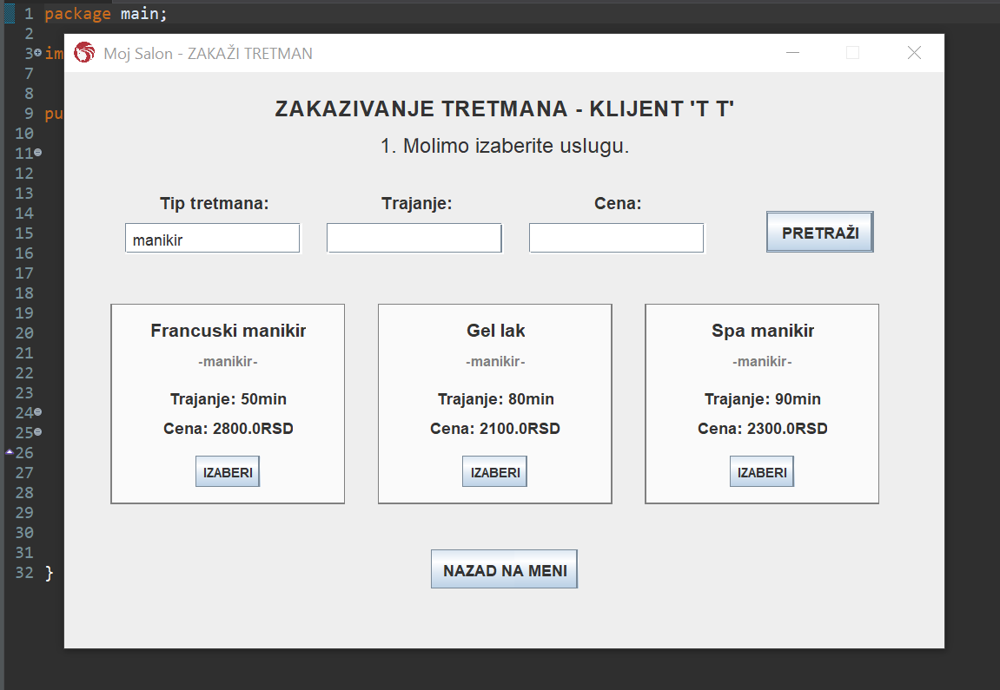

# Tamara Cvjetkovic

Beauty Salon

# Name of the project
Beauty Salon: application for a beauty salon.

# INFORMATIONS ABOUT THE STUDENT
- NAME: Tamara Cvjetković
- STUDENT INDEX: sv48-2022
- FACULTY: Faculty of Technical Science, Novi Sad
- STUDIES: Software Engineering and Information Technologies 
- ACADEMIC DEGREE: Bachelor with Honours in Software Engineering

- CONTACT: c.tamara02@gmail.com || cvjetkovic.sv48.2022@uns.ac.rs
- PHONE: +381 65 4468 114 (Serbia) || +387 66 868 639 (BiH)

# Project description
Project from subject named "Object-Oriented Programming"
FTN SIIT, 2nd semester, Novi Sad, 2023.

Beauty Salon is an object-oriented, event-driven, GUI application for a Beauty Salon (Java + Java Swing, with CRUD operations and serialization). Supports four user roles with distinct functionalities based on login credentials (Manager, Clients, Beauticians, Receptionists).

# For the development of the application, the following tools were utilized:
- Java
- Java Swing

# Functionalities:
The application offers specialized functionalities based on logged-in user. The roles are Client, Manager, Beautician, and Receptionist. Each role provides distinct features according to their responsibilities:
1) MANAGER:
CRUD operations on all users, cosmetic treatments, and salon data.
Access to insights, including reports on individual worker performance.
Overview of earnings and scheduled/completed treatments for specified time frames.
Authority to modify salon details such as name and working hours.
2) CLIENT:
Capability to schedule desired treatments with preferred Beauticians.
Access to a personal history of previously scheduled treatments.
3) BEAUTICIANS:
Execution of cosmetic treatments.
Access to a comprehensive record of all performed treatments.
4) RECEPTIONISTS:
Authority to schedule or reschedule treatments on behalf of clients.
Access to data regarding the total number of treatments performed.

# How to start the application:
After downloading all files, you can open the project in Java IDE and run the program/

# How to use
After you run the program, you can login or register. If you register, your profile is automatically saved as "Client". After logging-in (or after directly registering), depending on the role, you are given different options:
1) MANAGER:
You manage the whole application. You have the access to all data and you can add, edit or delete users, treatments and scheduled treatments or the salon informations (name, working hours etc..). Manager has also access to insight, including reports, earnings for specified time frames or diagrams (which you can access by clicking the button "Meni" in the top left corner).
2) CLIENT:
You can schedule your treatments by clicking the button "Zakazi tretman". You are given a list of all treatments, where you can search by type, name or/and price of the treatment. After you choose one, you can decide to choose your beautician or you can let the program automatically assign one free beautician for that role to you. Lastly, you choose one currently free appointment, by selecting date and hour. You can schedule the treatment by clicking button "Zakazi" or cancel it by pressing "Odustani". You can also go back to change something by clicking "Nazad".
On the profile window, there is a "Meni" where you can access all you previous/future treatments.
3) BEAUTICIANS:
On button "Raspored" you can see your word calendar/schedule of upcoming treatments that need to be done. On button "Izvrsi tretman" you "do" the treatment and mark it with "Done".
4) RECEPTIONISTS:
With "Zakazi tretman" you schedule a treatment for clients. You have all options that client has during scheduling a treatment. After clicking on "Meni", all scheduled treatments in the system are listed, where you can edit their state ("scheduled", "canceled", "done" etc..).

# Visual design:

